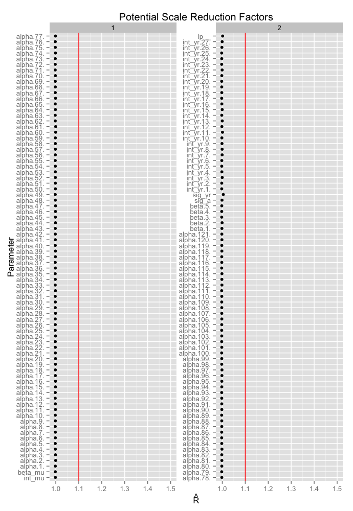

\renewcommand\thefigure{C\arabic{figure}}  

Appendix C: Model convergence diagnostics
=========================================
Scale reduction factors [@Gelman1992; @Gelman2009] were less than 1.1 for all fitted parameters (Figure C1).
Visual inspection of traceplots indicates convergence (Figures C2-C10).

Table:  Definition of parameters and model notation for Figures C1-C10.

| Parameter | Definition | Notation in figures |
| --------- | ---------- | -------------------------------------- |
| $\alpha_{i}$ | spatial random effect for for knot *i* | ``alpha.i`` where ``i`` is the numeric knot id |
| $\gamma_{x}$ | climate effect for covariate *x* | ``beta.x`` where ``x`` is the numeric climate covariate id |
| $\beta_{0t}$ | random effect for year *t* on the intercept | ``int_yr.t`` where ``t`` is the numeric year id |
| $\bar{\beta_{0}}$ | mean intercept | ``int_mu`` |
| $\beta_{1}$ | density-dependent effect | ``beta_mu`` |
| $\sigma_{\beta_{0}}^2$ | variance of year random effect | ``sig_yr`` |
| $\sigma_{\eta}^2$ | variance of spatial random effect | ``sig_a`` |

References
----------
